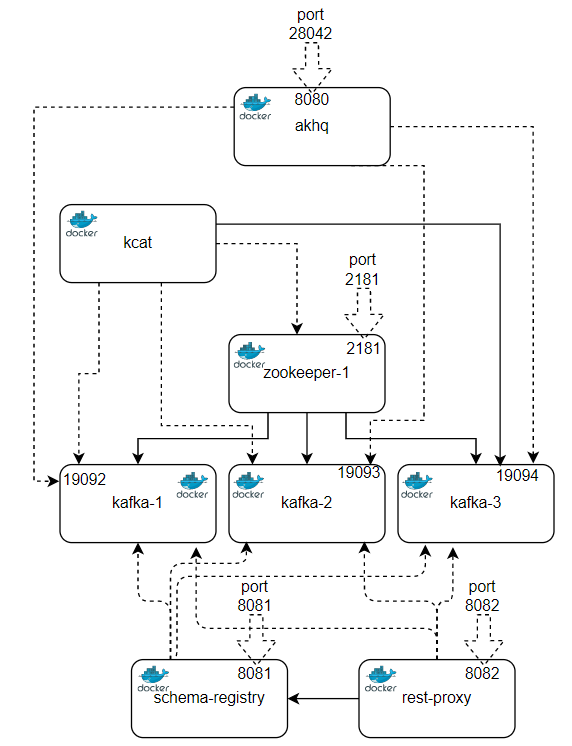
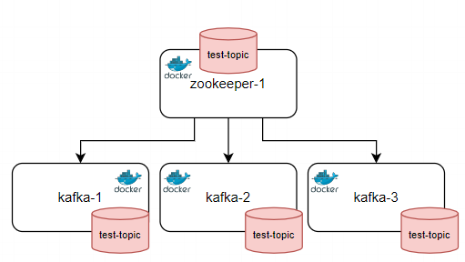
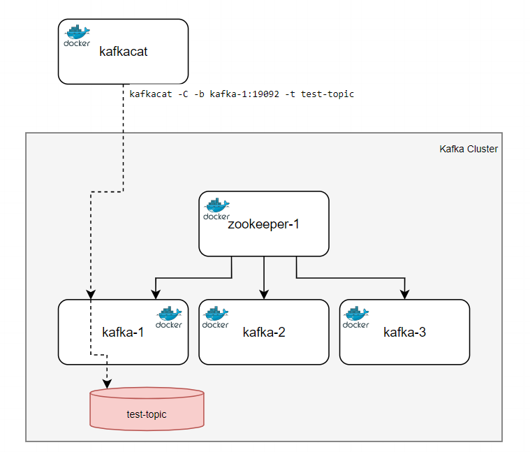
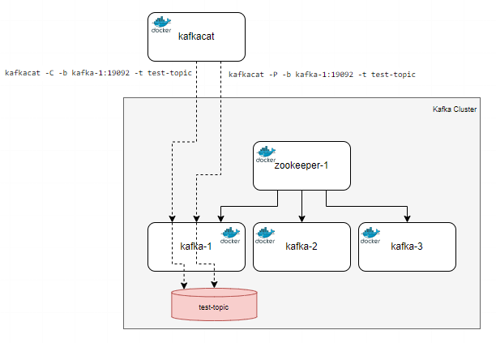
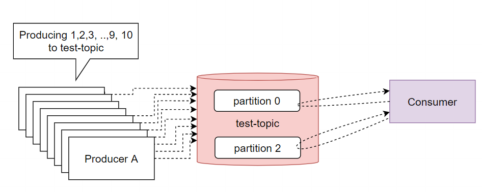
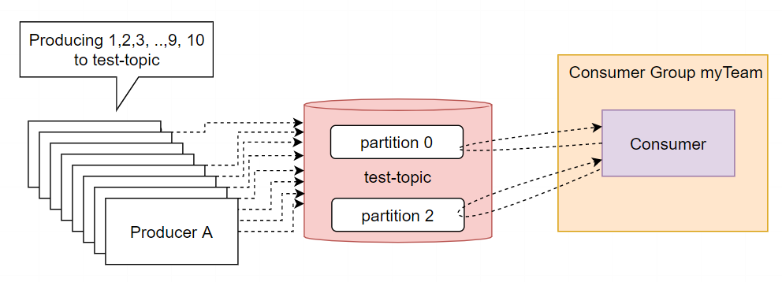
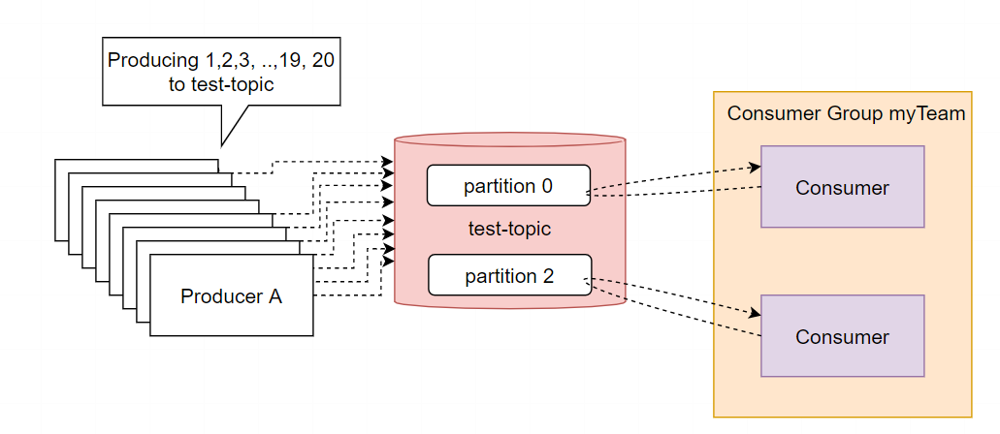
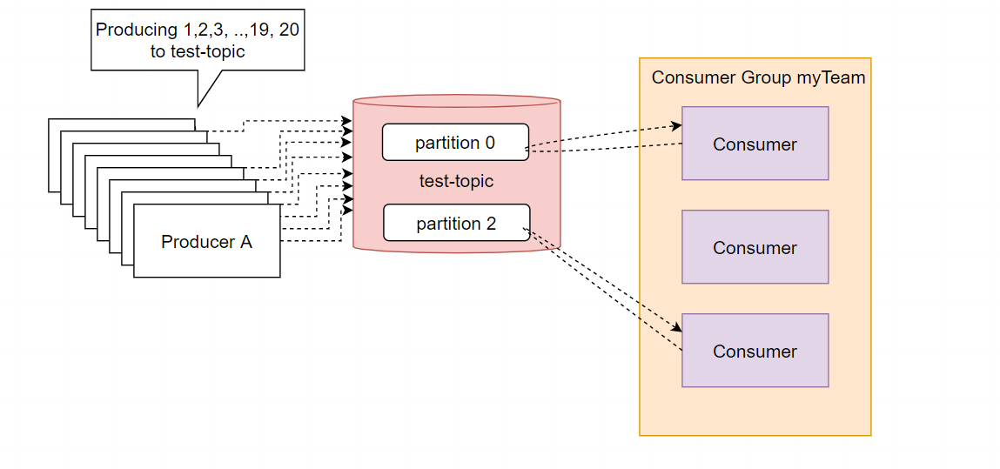
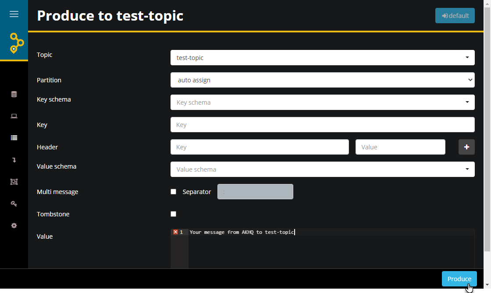

# Getting started with Apache Kafka

- [Getting started with Apache Kafka](#getting-started-with-apache-kafka)
  - [Inspect the environment](#inspect-the-environment)
  - [Connect to a Kafka Broker](#connect-to-a-kafka-broker)
  - [List topics in Kafka](#list-topics-in-kafka)
  - [Creating a topic in Kafka](#creating-a-topic-in-kafka)
    - [Describe a Topic](#describe-a-topic)
  - [Produce and Consume to Kafka topic with command line utility kcat (formerly known as kcat)](#produce-and-consume-to-kafka-topic-with-command-line-utility-kcat-formerly-known-as-kcat)
    - [Multiple "Parallel" Producers](#multiple-parallel-producers)
    - [Multiple Concurrent Consumers](#multiple-concurrent-consumers)
    - [Delete the test-topic](#delete-the-test-topic)
  - [Partitions and Consumer Groups](#partitions-and-consumer-groups)
    - [Topic with multiple partitions](#topic-with-multiple-partitions)
    - [Produce messages to multi-partition topic](#produce-messages-to-multi-partition-topic)
    - [Consumer Group for parallel and collaborative consumption and processing of messages](#consumer-group-for-parallel-and-collaborative-consumption-and-processing-of-messages)
  - [Using Apache Kafka HQ](#using-apache-kafka-hq)
    - [Produce a message in AK HQ](#produce-a-message-in-ak-hq)
- [Resources](#resources)

In this lab, you will have your first look and feel around Apache Kafka, using a Gitpod workspace. You can start this workspace using the URL: [https://gitpod.io/#https://github.com/lucasjellema/fontys-2024-microservices-messaging-kafka/](https://gitpod.io/#https://github.com/lucasjellema/fontys-2024-microservices-messaging-kafka/). Note: you will need a (free) Gitpod account in order to run the workspace. You can easily create such an account using a GitHub or GitLab account. Go to [gitpod.io/workspaces/](https://gitpod.io/workspaces/) and Log In with either GitHub or GitLab account. After doing that, you will be able to run the workspace.

The first thing you will see in terms of the Gitpod workspace is likely the VS Code IDE that launches in the browser. It will show you the source code from the GitHub repository. It probably also shows a terminal window in which docker-compose is running - starting up containers.

Once the workspace is fully launched, there will be several containers running - launched from a `docker-compose.yml` file. One container runs Zookeeper - a shared configuration database. Three containers run Kafka Brokers - the nodes in the cluster. Two final containers run the `kcat` utility (formerly known as *kafkacat*) and the `AK HQ` management console as well as the Kafka Schema Registry and the REST Proxy. A browser window is opened as well, showing the web console for `AK HQ` with information about the Kafka cluster. 

The main units of interest in Kafka are *topics* and messages. A topic is simply the destination to which you publish a message - and from which your application can consume messages. Topics contain a stream of messages. Messages are created by *producers* - and published on a topic. *Consumers* can register on a Topic and consume messages - at any point in time after they have been published (for as long as the messages are retained on the topic).

In this workshop you will learn how to create topics, how to produce messages, how to consume messages and how to describe/view metadata in Apache Kafka. 

Note: I gratefully made use of Guido Schmutz's https://github.com/gschmutz/stream-processing-workshop/tree/master/02-working-with-kafka-broker when compiling these instructions; Guido is a long time expert on messaging and streaming and he has published many articles, presentations and workshop documents.
    

## Inspect the environment

Make sure the Terminal tab is selected (and not for example the Output tab). Click on the plus sign on the right side of the screen to launch a new terminal; select `bash` as the terminal type. 
  

Type

`docker ps`

to list all running containers. The output should look as is shown below: eight containers running in the Gitpod workspace. 
  


Visualized the environment set up is like this:



## Connect to a Kafka Broker 
The environment contains a Kafka cluster with three brokers, all running on a single, non-distributed Docker host. To work with Kafka in this environment, you can:
* use the AK HQ web console
* use client libraries
* work with command line utilities: either the tools that are available on each broker (such as `kafka-topics`, `kafka-console-producer` and `kafka-console-consumer` ), or the more versatile `kcat` utility that runs in its own container.

The `kafka-topics` utility is used to create, alter, describe, and delete topics. The `kafka-console-producer` and `kafka-console-consumer` can be used to produce/consume messages to/from a Kafka topic. So let's connect into one of the broker through a terminal window. 

In the bash terminal you launched a little bit earlier, use `docker exec` command to start a shell in the `kafka-1` docker container 

```
  docker exec -ti kafka-1 bash
```

You will enter the `kafka-1` container. The prompt will change to `[appuser@kafka-1 ~]$`. If you type `hostname` you will be informed of the name of the host - which is the name of the container i.e. `kafka-1`.


## List topics in Kafka

First, let's list the topics available on your Kafka Cluster. For that we use the `kafka-topics` utility with the `--list` option. 

```
kafka-topics --list --bootstrap-server kafka-1:19092
```

We can see that there are no topics yet.  

  

## Creating a topic in Kafka

Now let's create a new topic. For that we again use the **kafka-topics** utility but this time with the `--create` option. We will create a test topic with 1 partition and replicated 2 times. The `--if-not-exists` option is handy to avoid errors, in case a topic already exists. 

```
kafka-topics --create --if-not-exists --bootstrap-server kafka-1:19092 --topic test-topic --partitions 1 --replication-factor 2
```

Re-Run the command to list the topics.
```
kafka-topics --list --bootstrap-server kafka-1:19092
```
You should see the new topic you have just created. 

### Describe a Topic

You can use the `--describe` option to get details on a specific topic, such as the distribution of the partitions over the cluster nodes (aka brokers).

```
kafka-topics --describe --bootstrap-server kafka-1:19092 --topic test-topic
```

The test-topic is a shared object throughout the cluster. The contents of the topic is replicated across two brokers.

  

## Produce and Consume to Kafka topic with command line utility kcat (formerly known as kcat)

Now let's see the topic in use. The most basic way to test it is through the command line. Kafka comes with two handy utilities `kafka-console-consumer` and `kafka-console-producer` to consume and produce messages through the command line; these utilities run on the any Kafka broker, including the one you are currently connected to. You can publish your first message to a Kafka Topic for example with this command:

```
echo "This is my first message!" | kafka-console-producer --broker-list kafka-1:19092,kafka-2:19093 --topic test-topic
```

There is also an even more convenient command line tool - *kafkacat* also known as *kcat* - that runs in a different container. 

Click on the plus sign on the right side of the screen to launch a new terminal; select `bash` as the terminal type. 

Execute this command in the new terminal to launch yourself right into this container:

```
docker exec -ti kcat sh
```

To verify your Kcat version, enter the following command:
```
kcat -V
```

You can now start executing `kcat` commands - to inspect, produce to and consume from Kafka topics (see [the documentation of Kcat](https://github.com/edenhill/kcat)). Let's first inspect the `test-topic`:

```
kcat -L -b kafka-1:19092 -t test-topic
```

You will get some details on the nature of the `test-topic`. The topic's replication factor is set to 2. This means that all messages are written to file on two separate brokers, in two separate files. If one is lost, the message is still safe. Usually a higher replication factor will be picked - depending on the use case, the volume of the data and the reliability requirements.

Next, to consume all messages from the `test-topic`, execute this next command:

```
kcat -C -b kafka-1:19092 -t test-topic
```

  

This will list the message "This is my first message!" that was published to the topic earlier on. Then the output will read *Reached end of topic test-topic [0] at offset 1*. Offset is an important concept in Kafka: it is the pointer into a topic's message queue. The current consumer is consuming from offset 1 onwards - and currently there no more messages from this offset and beyond. New consumers can be started - configured with their own specific offset to start consuming from. These consumers can start consuming from offset 0 or at least the lowest offset still available, or from the current offset to only consume messages produced after they started running. Or a consumer can be configured for an offset or even a timestamp anywhere in between.

Note that `kcat` keeps on listening to the topic for more messages to appear. You can quit this *session* at any time with <kbd>Ctrl</kbd> + <kbd>C</kbd>. However, keep the consumer running for now - to see additonal messages coming in.


Click on the plus sign on the right side of the screen to launch another new terminal that we will use for publishing messages to the topic; select `bash` as the terminal type. 

Execute this command in the new terminal to launch yourself right into this container:

```
docker exec -ti kcat sh
```

As before, you can now execute  `kcat` commands - to inspect, produce to and consume from Kafka topics. Let's produce a message:

```
echo "A special message from kcat" | kcat -P -b kafka-1:19092 -t test-topic 
```

(check in the other terminal if this message is consumed / shown)

We can publish messages after running this next command by typing them at the command line. Press enter to create a new message:

```
kcat -P -b kafka-1:19092 -t test-topic 
```

  

You are now in a production session: every line of text you type is produced as a message when you press enter. Type a few lines of text - each line will be a message published to the test-topic. When you press <kbd>Ctrl</kbd> + <kbd>D</kbd>, the messages will be published to the topic (and the kcat session is concluded). Check in the previous terminal - to see that the messages you typed were indeed consumed. And arrived in the order in which you typed them. 

Enter this command to use `cat` to create a file with a few lines of text. Each line will be turned into a message produced to the Kafka Topic.

```
cat > file.txt
```

Enter some text, type enter, type some more text and press enter again. Perhaps one or two additional lines. Then <kbd>Ctrl</kbd> + <kbd>Z</kbd> to suspend the editing session.

Use `cat file.txt` to inspect the contents of the file you have created.

Then execute this command to have every line in the file published as a message to the test-topic:

```
kcat -P -b kafka-2:19093 -t test-topic -l file.txt
```
Check in the terminal window where the consumer is still running if the messages arrive - as they should.

Note how this command refers to a different Kafka broker than before: kafka-2. Kafka topics can be produced to and consumed from through any Kafka broker in the cluster. 


With this command you can have the entire file published as a single message to the test-topic; this command accesses the third broker in the Kafka cluster and publishes the contents of the file `file.txt` as a single message:

```
kcat -P -b kafka-3:19094 -t test-topic file.txt
```

Check in the consumer terminal that the file arrived - as a single message (note the value of *offset* - that acts more or less as a message counter).

### Multiple "Parallel" Producers

We have seen multiple producers produce messages to the same topic. They were not running at the same time, but they could have been. However, messages are committed to the topic in a specific order. Messages on the topic are saved and will be consumed in the exact order in which they were processed by the brokers. There is not an actual, explicit locking mechanism - but there is locking going on all the same: a message that is produced needs to be written to multiple files before the next message can be accepted for production onto the topic. Note that we can produce multiple messages in a batch to the topic - these are all saved at the same time, committed as a single transaction. 

Run the following command in the same Docker container) - to have ten messages produced to the topic at roughly the same time: 

```
for i in "I" "II" "III" "IV" "V" "VI" "VII" "VIII" "IX" "X"
do
   echo "This is message $i from producer B"| kcat -P -b kafka-2:19093 -t test-topic   &
done 
```

By ending the command in the loop with an & character, we run each command in the background and all loop iterations therefore in parallel. This will mean that the messages will most likely arrive a little out of (loop) order. 

  

Check in the consumer window if all messages arrived - and in which order.

We can get a little bit more information about the messages that are consumed from the topic. Stop the consumer - using <kbd>Ctrl</kbd> + <kbd>C</kbd>. Now run this command to get the messages from the topic - this time with extended details:

```
kcat -C -b kafka-1:19092 -t test-topic -f '\n\nValue (%S bytes): %s\nTimestamp: %T\tOffset: %o\n--\n'
```

The flags passed into to the *-f* option have the following meaning: %S is size in bytes, %s is the message body, %T is timestamp and %o is message offset. Other flags are %t for topic, %p for partition, %h for message headers and %k for key. 

### Multiple Concurrent Consumers 

Multiple consumers can consume messages from the same topic. Consumers can come and go whenever they like. When they come, they can indicate where in the message stream they want to start consuming: at the very beginning (the default with `kafkcat -C`), at a specific offset or timestamp, right now (only new messages). Consumers can run in parallel and will not interfere with each other.

Open one more bash terminal window - where we will look at consumers that run in parallel to the one you started just now with the extended message details. That consumer will continue to run and to consume and nothing we will with additional consumers is going to disturb it.

In the new bash terminal, execute this command 

```
docker exec -ti  kcat  kcat  -b kafka-1:19092 -C -f '\n\nValue (%S bytes): %s\n\Partition: %p\tOffset: %o\n--\n'  -t test-topic
```

  

This lists all messages on the test-topic, in the order of course in which they were produced. 

Switch to the producer terminal and produce a new message to the topic:

```
echo "New Message" | kcat -P -b kafka-1:19092 -t test-topic 
```

Now check if this new message was indeed received in both consumer terminals.

You can stop the consumer with <kbd>Ctrl</kbd> + <kbd>C</kbd> to return to the bash shell (and leaving the `kcat` container).

Finally, let's see how a consumer can be started from a specific offset in the topic. The flag `-o` is used to specify the starting offset. It can have the values *beginning*, *end*, *some specific number*, *negative number*, *s@timestamp*, *e@timestamp*. These indicate respectively:

* consume all messages from the beginning
* consume all messages starting right now (only new messages)
* consume all messages starting from the specified offset
* consume new messages as well as first the most recent X messages where X is the absolute value of the negative number
* consume all messages starting from the indicated timestamp 
* consume all messages up until the indicated timestamp

To get only new messages consumed, run the following command. Note the `-o end` passed in:

```
docker exec -ti  kcat  kcat  -b kafka-1:19092 -C -f '\n\nValue (%S bytes): %s\n\Partition: %p\tOffset: %o\n--\n'  -t test-topic -o end
```

Switch to the producer terminal and produce a new message to the topic:

```
echo "Another new Message" | kcat -P -b kafka-1:19092 -t test-topic 
```

And check in both consumer terminals to find that this message has been consumed. Or to see the last 5 messages on `test-topic`, stop the consumer and execute:

```
docker exec -ti  kcat  kcat  -b kafka-1:19092 -C -f '\n\nValue (%S bytes): %s\n\Partition: %p\tOffset: %o\n--\n'  -t test-topic -o -5
```

Switch to the producer terminal and produce a new message to the topic:

```
echo "Final New Message" | kcat -P -b kafka-1:19092 -t test-topic 
```

Again, check in both consumer terminals to find that this message has been consumed.

You can also specify how many messages you want to consume, by specifying `-c<num>`. For example, to consume a single message: add `-c1` to the `kcat -C` command. Once that number has been consumer, the consumer will stop running.

### Delete the test-topic

In the bash terminal window you opened into the `kafka-1` container, delete the test-topic - and all data it currently contains - using the following command: 

```
kafka-topics --delete  --bootstrap-server kafka-1:19092 --topic test-topic 
```

You can check if the consumers have noticed that the topic no longer exists. They should have - as they frequently try to contact the brokers regarding the topic and should be informed that the topic is no longer available.


## Partitions and Consumer Groups

When we created topic *test-topic* earlier on we specified `-partitions 1`. We did not talk about partitions at that point, but now we will. Topics can - and usually will be - partitioned. Partitions are both a logical and a physical subdivision of the topic. Messages assigned to a different partitions are stored in different logfiles. Each message belongs to exactly one partition. Having multiple partitions and multiple underlying files means that the parallel processing capacity in terms of message production to a topic is increased. Different messages can be written to different partitions at the same time in the same cluster. Additionally, having multiple partitions also allows us to run multiple collaborating consumers in groups (almost a team) for parallel processing the messages on a topic. Each consumer handles the messages in one or more partitions and each partition is associated with exactly one consumer in the (consumer) group. Note: we can still have multiple unrelated consumers or consumer groups running in parallel listening to the same topic, each processing all messages. Note that messages are ordered in order of production within the partition. There is no concept of ordering across partitions. Only by comparing timestamps for messages in different partitions can we more or less derive the respective order.

### Topic with multiple partitions

Use the next command to recreate the *test-topic* , this time with two partitions - in the bash terminal window that `docker exec`-ed into the `kafka-1` container.

```
kafka-topics --create --if-not-exists --bootstrap-server kafka-1:19092 --topic test-topic --partitions 2 --replication-factor 2
```

Inspect the topic using the command:

```
kafka-topics --describe --bootstrap-server kafka-1:19092 --topic test-topic
```

  

Two partitions for a topic mean that messages are distributed over these partitions and are saved in one of the two. The allocation of a message can be done in several ways:
* explicitly specifying the partition when producing the message
* let Kafka calculate the destination partition based on a partition key (some value in the message); all messages with the same partition key are guaranteed to end up in the same partition. Usually the number of key values is larger than the number of partitions and messages with different values for the partition key end up in the same partition
* have Kafka choose the partition using a round-robin partition assignment. The messages will be written evenly across all partitions of a particular topic.

### Produce messages to multi-partition topic

If we now publish a few messages without specifying the partition or the key, these messages will be distributed across the partitions by Kafka.

In the producer terminal - or a new terminal where you have executed `docker exec -it kcat sh` , run the following command - to have ten messages produced to the topic at roughly the same time (since we do not specify the target partition, Kafka will itself distribute the messages over the partitions): 

```
for i in 1 2 3 4 5 6 7 8 9 10 
do
   echo "This is message $i from producer A"| kcat -P -b kafka-2:19093 -t test-topic   &
done 
```

  

Check in a bash terminal - not inside a Docker container -  if the partition assignment is clearly visible:

```
docker exec -ti  kcat  kcat  -b kafka-1:19092 -C -f '\n\nValue (%S bytes): %s\n\Partition: %p\tOffset: %o\n--\n'  -t test-topic -o -10
```

You will notice that roughly half of the messages went into one partition and the other half into the other.

With these small numbers of messages, we do not experience the speed up that potentially happens when messages can be produced in parallel. With large volumes of messages, this can make a substantial difference. By using multiple partitions, we also ensure that the logs - the files in which the messages are saved - are smaller and easier to manage. 

### Consumer Group for parallel and collaborative consumption and processing of messages

Part of the value of partitions is the fact that they allow parallel consumption by consumers that work together - each performing the same task on a different set of messages. A consumer group is akin to a team of people that process for example all mail in the inbox. They have to coordinate their work to make sure that all messages are processed and that every message is processed only once. Consumer groups contain multiple consumers all processing messages from the same topic, but from different partitions. Every partition is assigned to one of the consumers in a consumer group. Consumers can have multiple partitions assigned. A partition can not be shared by multiple consumers in the same consumer group. Having more consumers in the group than partitons in the topic is therefore not useful.

Execute in one bash terminal:

```
docker exec -ti  kcat  kcat  -b kafka-1:19092 -C -G myTeam test-topic  
```

This runs a consumer that is in the consumer group call *myTeam*. Currently it is the only team member, so all messages are consumed by this consumer. You can derive this from the *rebalance* messages in the output.

  

In another terminal, execute the same command. This creates the second consumer in the group, the second team member to come and help out:

```
docker exec -ti  kcat  kcat  -b kafka-1:19092 -C -G myTeam test-topic  
``` 

We see some additional group rebalancing taking place - for both consumers. The team members organize the work amongst themselves - each taking responsibility for one of the partitions. 

When we next produce a number of messages, we should see that these messages - distributed as they are over the partitions - are processed by one of the two consumers in the group. And not by both. And presumably the overall time required for the consumption and processing of these messages is substantially reduced (by close to 50%) by having the consumer group running.

In the producer terminal, execute the following command:

```
for i in 1 2 3 4 5 6 7 8 9 10 11 12 13 14 15 16 17 18 19 20
do
   echo "This is message $i from producer A"| kcat -P -b kafka-2:19093 -t test-topic   
done 
```
20 messages are produced to the topic. They are distributed more or less evenly between the two partitions. And each partition is consumer by one of the consumers in the consumer group. Check the two consumer terminals - to find out if both got a share of the workload, if all messages were processed and if no messages were processed twice. Because the & was no longer included in the command - unlike before - the production of the messages was done sequentially. Each consumer should have processed all messages in the correct order. The two consumers worked independently of each other.

  

If we now add a third member to the team - or a third consumer to the consumer group - you might think that processing goes even faster. However, there is no partition for this additional consumer to process messages from. The only way to benefit from this consumer would be by introducing additional partitions in the topic.

To verify this, open yet another bash terminal, execute the same command as before. This creates the third consumer in the group, the third team member to come and help out:

```
docker exec -ti  kcat  kcat  -b kafka-1:19092 -C -G myTeam test-topic  
``` 

Group rebalancing takes place. You may find that the new consumer is assigned a partition, but then one of the earlier consumers no longer has a partition to consume from. Between the three consumers, one is without partition assignment. This shows up in the output as `% Group myTeam rebalanced (memberid ...): assigned:`; in other words: assigned to: 'empty', no partition assignment).


  


## Using Apache Kafka HQ

[Apache Kafka HQ](https://akhq.io/) is an open source tool for managing a Kafka cluster: a GUI for Apache Kafka® to manage topics, topics data, consumers group, schema registry, connect and more... It has been started in the Gitpod workspace and was opened in a browser window in the IDE. Note you can open Apache Kafka HQ in a separate browser tab, outside VS Code.

The first page in AKHQ shows an overview of the cluster and its nodes. Note: the connection from AKHQ to the Kafka platform is defined in docker-compose.yml, that is where the name for the cluster ("docker-kafka-server") stems from.

 

You can inspect the details for each node - through the looking glass icon or just by clicking on the row for the node. This reveals the configuration settings for the node as well as an overview of the logs managed on the node/by the broker.

 

The Topics page shows the topics currently created on the entire Kafka Cluster. You will see the *test-topic* that you have just created through the Kafka Console utility. If you show all topics, you will also see one or more internal topics, used by Kafka for housekeeping. The *__consumer_offsets* topic keeps track of the *read offset* for all consumers (or rather: for all consumer groups).

 

You can see the number of messages on the *test-topic* as well as the number of partitions and the replication factor. You can downdrill on the topic, to level of the actual messages in the message log:

  

You should see the messages that you have just been producing through the Kafka Console. You can see the messages' production time and offset, their size, key and contents and the partition to which they have been assigned. You cannot change any of these properties - the message log is immutable.

Other tabs in AKHQ for the topic provide access to the partitions (and their current offset), Consumer Groups consuming from the topic, the configuration, ACLs (Access Control Lists) and the message logs themselves. 

The consumer group composition and the partition allocation can easily be checked as well. 

  

### Produce a message in AK HQ
Click on the button *Produce to Topic*. A window opens where you can define the message to produce. You only need to enter a message text. Then press Produce.

  

You will see an indication that the message has been produced to the topic. 

  

Now check in the bash terminal where the Kafka Consumer is running. You will see your own message, produced from the AKHQ application to the *test-topic*. Note: this Kafka Console Consumer session has been associated with an auto-generated Consumer Group (console-consumer-<generated number>). When you stop and start the console consumer, you will continue to consume from the previous offset reached in the console - unless you specify the *from-beginning* switch. 

The message is also visible in AKHQ if you inspect the details for the *test-topic*. Note: the message may not have the highest offset of them all. The offset is defined per partition - so the offset value for your message depends on the previous offset in the specific partition selected by the Kafka Cluster for the message.

When you produce a message in the Kafka Console, that message will of course show up in the GUI of AKHQ as well.


# Resources
A nice introductory article on Apache Kafka: [Part 1: Apache Kafka for beginners - What is Apache Kafka?](https://www.cloudkarafka.com/blog/2016-11-30-part1-kafka-for-beginners-what-is-apache-kafka.html)

Kcat - introduction to the command line utility: [Learn how to use Kcat – the most versatile Kafka CLI client](https://codingharbour.com/apache-kafka/learn-how-to-use-kafkacat-the-most-versatile-cli-client/)

